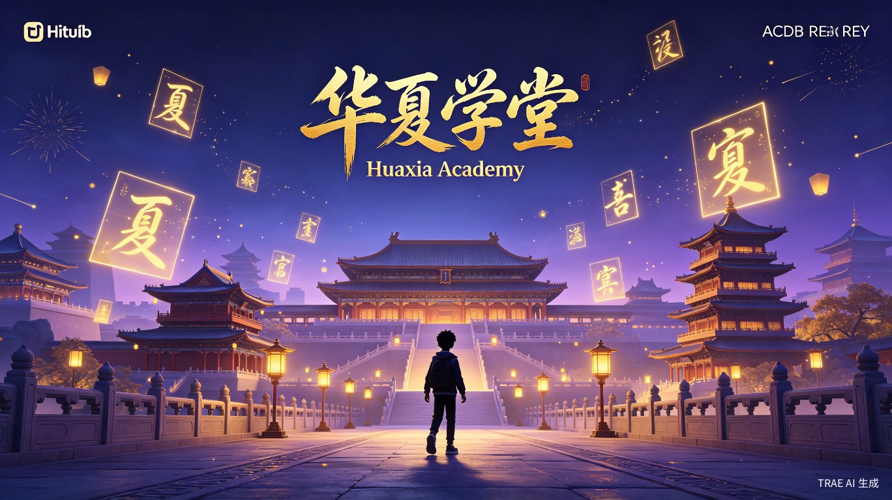
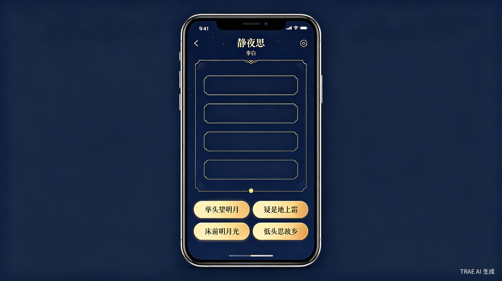
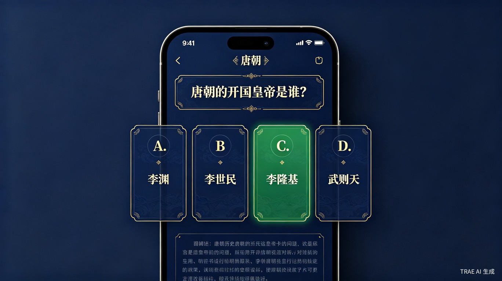
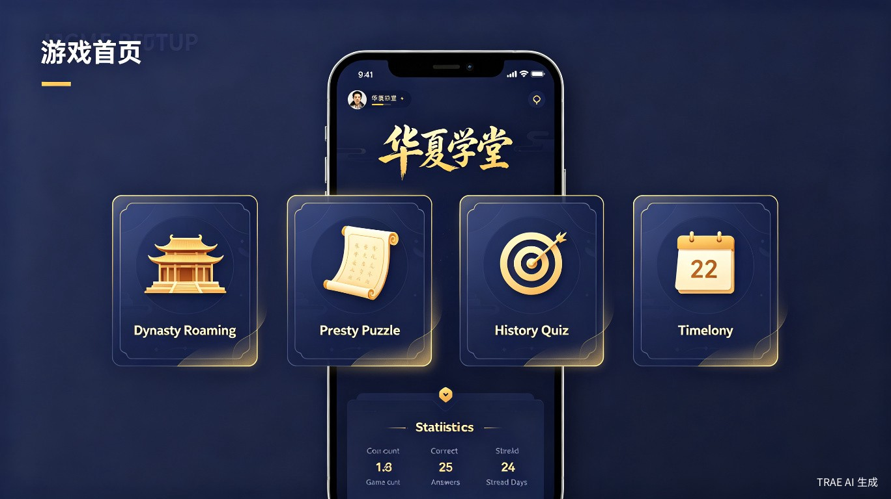

# 🏛️ 华夏学堂 | Huaxia Academy

<p align="center">
  
</p>

<p align="center">
  <strong>穿越千年，与古人对话 — Immersive 3D Chinese History & Literature Learning Game</strong>
</p>

<p align="center">
  <a href="#-功能特性--features">功能特性</a> •
  <a href="#-技术栈--tech-stack">技术栈</a> •
  <a href="#-快速开始--quick-start">快速开始</a> •
  <a href="#-游戏模式--game-modes">游戏模式</a> •
  <a href="#-项目结构--project-structure">项目结构</a>
</p>

---

## 📖 项目简介 | About

**华夏学堂 (Huaxia Academy)** 是一款基于 Three.js 的沉浸式 3D 历史语文益智学习游戏，专为 2-18 岁中文学习者设计。通过 3D 场景漫游、诗词拼图、历史问答等互动方式，让学习历史和语文变得生动有趣。

> **Huaxia Academy** is an immersive 3D Chinese history and literature educational game built with Three.js. Designed for learners aged 2-18, it makes learning Chinese history and language engaging through 3D scene exploration, poetry puzzles, history quizzes, and more.

## ✨ 功能特性 | Features

### 🎮 核心玩法 | Core Gameplay
| 特性 Feature | 描述 Description |
|:---:|:---|
| 🏛️ **朝代漫游 Dynasty Roaming** | 3D 场景自由探索，点击历史人物互动对话 |
| 📜 **诗词拼图 Poetry Puzzle** | 经典诗词打乱重组，还原名篇佳句 |
| 🎯 **历史问答 History Quiz** | 20+ 道精选题目，覆盖唐宋历史知识 |
| 📅 **历史年表 Timeline** | 可视化历史大事年表，纵览千年变迁 |

### 👤 学习系统 | Learning System
- 📱 **手机号登录** — Phone number login with verification
- 🎚️ **年龄段分级** — Age-based difficulty (2-6, 7-12, 13-15, 16-18)
- 📊 **学习统计** — Game stats, accuracy tracking, streak days
- 📖 **错题本** — Mistake review system for targeted learning
- 🏆 **等级成长** — Level & experience progression system
- 🔊 **语音朗读** — Web Speech API for poem recitation
- 🎵 **音效系统** — Web Audio API for immersive sound effects

### 🎨 视觉设计 | Visual Design
- 🌙 **深色主题** — Dark theme with golden accents for eye comfort
- 🏯 **古风 3D 场景** — Ancient Chinese architecture in low-poly 3D
- ✨ **粒子特效** — Golden particle effects for magical atmosphere
- 📱 **响应式布局** — Mobile-first responsive design

## 🛠️ 技术栈 | Tech Stack

| 技术 Technology | 用途 Purpose |
|:---:|:---|
|  | 3D 渲染引擎 3D Rendering |
|  | 类型安全 Type Safety |
|  | 构建工具 Build Tool |
|  | 样式框架 Styling |
|  | 动画引擎 Animation |
|  | 音效系统 Audio |
|  | 语音合成 Speech |

## 🚀 快速开始 | Quick Start

### 环境要求 | Prerequisites
- Node.js >= 18
- npm >= 9

### 安装运行 | Install & Run

```bash
# 克隆项目 Clone the repository
git clone https://github.com/Jsoned/huaxia-academy.git
cd huaxia-academy

# 安装依赖 Install dependencies
npm install

# 启动开发服务器 Start dev server
npm run dev
```

打开浏览器访问 http://localhost:3000 即可体验。

### 构建部署 | Build & Deploy

```bash
# 生产构建 Production build
npm run build

# 预览构建结果 Preview build
npm run preview
```

构建产物在 `dist/` 目录，可部署到任意静态服务器、H5 平台或微信小程序。

## 🎮 游戏模式 | Game Modes

### 1. 🏛️ 朝代漫游 | Dynasty Roaming
<p align="center">
  
</p>

进入 3D 古代场景，自由探索唐朝和宋朝的世界。点击场景中的历史人物，了解他们的生平故事和经典名言。

> Enter a 3D ancient world and explore the Tang and Song dynasties. Click on historical figures to learn their stories and famous quotes.

**包含人物 Included Characters:**
- 🐉 **唐朝 Tang:** 李白、杜甫、王维、白居易、李世民、武则天
- 🌊 **宋朝 Song:** 苏轼、李清照、辛弃疾、陆游、岳飞、王安石

### 2. 📜 诗词拼图 | Poetry Puzzle
<p align="center">
  
</p>

经典诗词的句子被打乱顺序，按正确顺序点击还原。包含 12 首唐诗宋词名篇。

> Classic poem lines are shuffled — tap them in the correct order to restore the masterpiece. Features 12 famous Tang and Song dynasty poems.

### 3. 🎯 历史问答 | History Quiz
<p align="center">
  
</p>

20+ 道精选历史知识题目，涵盖唐宋两朝重要人物、事件和文化知识。答错自动收入错题本。

> 20+ curated history questions covering important Tang and Song dynasty figures, events, and culture. Wrong answers are automatically saved for review.

### 4. 📅 历史年表 | Timeline

可视化时间线展示 10 个重大历史事件，从贞观之治到岳飞抗金，一目了然。

> A visual timeline showcasing 10 major historical events, from the Zhenguan Reign to Yue Fei's resistance against the Jin dynasty.

## 📱 首页预览 | Home Preview

<p align="center">
  
</p>

## 📁 项目结构 | Project Structure

```
huaxia-academy/
├── src/
│   ├── main.ts                 # 应用入口 App entry
│   ├── components/
│   │   ├── LoginPage.ts        # 登录页面 Login page
│   │   ├── HomePage.ts         # 首页 Home page
│   │   ├── GamePage.ts         # 游戏页面 Game page
│   │   └── ProfilePage.ts      # 个人中心 Profile page
│   ├── core/
│   │   ├── Scene3D.ts          # 3D 场景基类 Base 3D scene
│   │   └── DynastyScene.ts     # 朝代场景 Dynasty scene
│   ├── data/
│   │   └── dynasties.ts        # 历史数据 Historical data
│   ├── types/
│   │   └── index.ts            # 类型定义 Type definitions
│   └── utils/
│       ├── audio.ts            # 音频管理 Audio manager
│       └── storage.ts          # 数据存储 Storage manager
├── docs/                       # 文档与截图 Docs & screenshots
├── index.html                  # HTML 入口 HTML entry
├── package.json
├── tsconfig.json
└── vite.config.ts
```

## 📊 数据内容 | Content

| 内容 Content | 数量 Count | 说明 Description |
|:---:|:---:|:---|
| 👤 历史人物 | 12 | 唐朝 6 + 宋朝 6 Historical characters |
| 📜 经典诗词 | 12 | 唐诗宋词名篇 Famous poems |
| ❓ 问答题 | 20+ | 唐宋历史知识 History quiz questions |
| 📅 历史事件 | 10 | 重大历史节点 Major events |

## 🌐 适用场景 | Use Cases

- 📚 **语文学习** — 诗词背诵、文言文理解、文学常识
- 🏛️ **历史学习** — 朝代知识、历史人物、重大事件
- 👨‍👩‍👧 **家庭教育** — 亲子互动学习，适合 2-18 岁全年龄段
- 🏫 **课堂辅助** — 教师可用于课堂互动教学
- 📱 **H5 小游戏** — 可部署为微信小程序或 H5 页面

## 📄 License

MIT License - 自由使用，欢迎 Star ⭐

---

<p align="center">
  Made with ❤️ for Chinese Culture Education<br>
  用代码传承华夏文明
</p>
